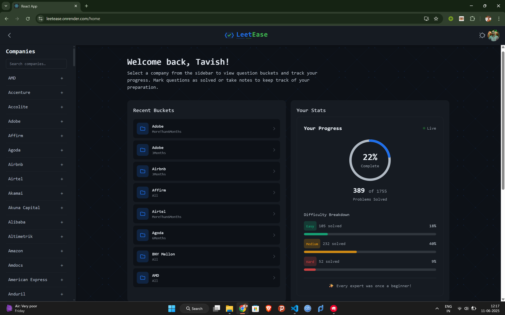
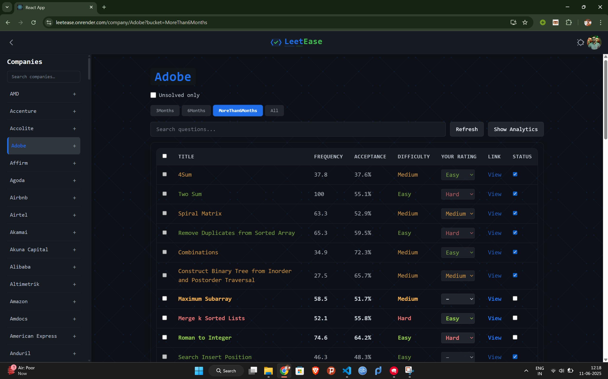
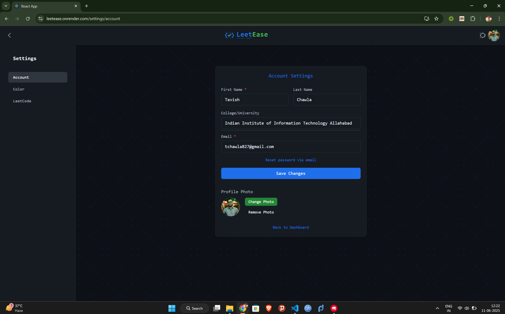

# 🌐 [LeetEase – Live Demo](https://leetease.onrender.com/)

> Your personal tracker for company-specific LeetCode preparation.

**LeetEase** is a full-stack web application to help you practice **company-specific LeetCode** questions efficiently.

Built with a **Flask** backend and a **React + Tailwind CSS** frontend, LeetEase lets users sync solved questions directly from LeetCode, track progress, and explore curated question sets organized by companies and preparation timelines.

---

## 🚀 Features

- 🔐 **Email authentication** with OTP verification and password reset  
- 🔗 **Google Sign-In** using OAuth  
- 🧑‍💻 **Profile management** with photo upload  
- 🔄 **LeetCode sync** using session cookies  
- 🏢 **Company-wise bucket system**: 30 days, 3 months, 6 months, and more  
- ✅ **Question tagging and solve tracking**  
- 📊 **Progress analytics and visual stats**  
- 🛠️ **Admin tools** for importing questions from CSV/Excel  
- 🛡️ **JWT-based secure APIs**, CSRF protection, and strict CORS configuration  

---

## 🖼️ UI Previews

### 🏠 Home Page  
> Overview of the platform with quick access to features and navigation  


---

### 🏢 Company Buckets  
> Browse and solve curated questions by company and preparation timeline  


---

### 📈 Analytics & Progress  
> View your stats and company-wise progress  


---

### ⚙️ Settings Page  
> Manage account info, preferences, sync options, and more  


---

## 🧪 Local Development Setup

> Prerequisites: **Python 3.11+**, **Node.js 20+**

```bash
# Optional: Setup Python virtual environment
python3 -m venv venv
source venv/bin/activate

# 1. Install backend dependencies
pip install -r backend/requirements.txt

# 2. Build the frontend
cd frontend
npm install
npm run build
cd ..

# 3. Copy and edit environment variables
cp backend/.env.example backend/.env
# Edit values in backend/.env

# 4. Ensure MongoDB is running
docker compose up mongo

# 5. Start the backend server
FLASK_DEBUG=1 python backend/app.py
```

🔗 Visit: `http://localhost:5000`

---

## 🐳 Running with Docker (Recommended)

> Avoid installing Python/Node locally. Use containerized development.

```bash
# 1. Copy and configure environment files
cp backend/.env.example backend/.env
cp frontend/.env.example frontend/.env

# 2. For local HTTP:
echo "JWT_COOKIE_SECURE=False" >> backend/.env
sed -i "s|REACT_APP_API_URL=.*|REACT_APP_API_URL=|" frontend/.env

# 3. Build and run containers
docker compose up --build
```

🔗 Visit: `http://localhost:5000`

---

## ⚙️ Configuration

### 🔒 Backend Environment Variables (`backend/.env`)

| Key                | Description                          |
|--------------------|--------------------------------------|
| `SECRET_KEY`       | Flask session key                    |
| `MONGODB_URI`      | MongoDB connection string            |
| `JWT_SECRET_KEY`   | JWT signing key                      |
| `GOOGLE_CLIENT_ID` | Google OAuth Client ID               |

> App won't start if any are missing

---

### 🛡️ CSRF & CORS

- **CSRF**: `csrf_token` cookie set by backend and sent via `X-CSRFToken` header from frontend.
- **CORS**: Only origins listed in `CORS_ORIGINS` may access the API with credentials.

---

### 🎯 Frontend Environment (`frontend/.env`)

| Key                         | Description                                      |
|-----------------------------|--------------------------------------------------|
| `REACT_APP_GOOGLE_CLIENT_ID` | Google Identity Services client ID              |
| `REACT_APP_API_URL`         | Backend API URL (empty if same origin)          |

---

## 🧑‍💻 Development Scripts

```bash
# Run frontend dev server
cd frontend
npm start
```

```bash
# Run backend dev server
FLASK_DEBUG=1 python backend/app.py
```

---